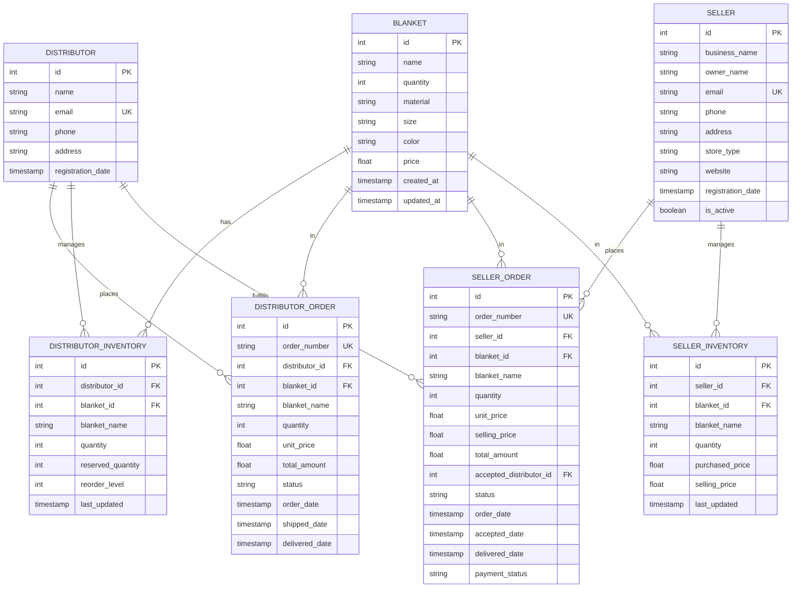
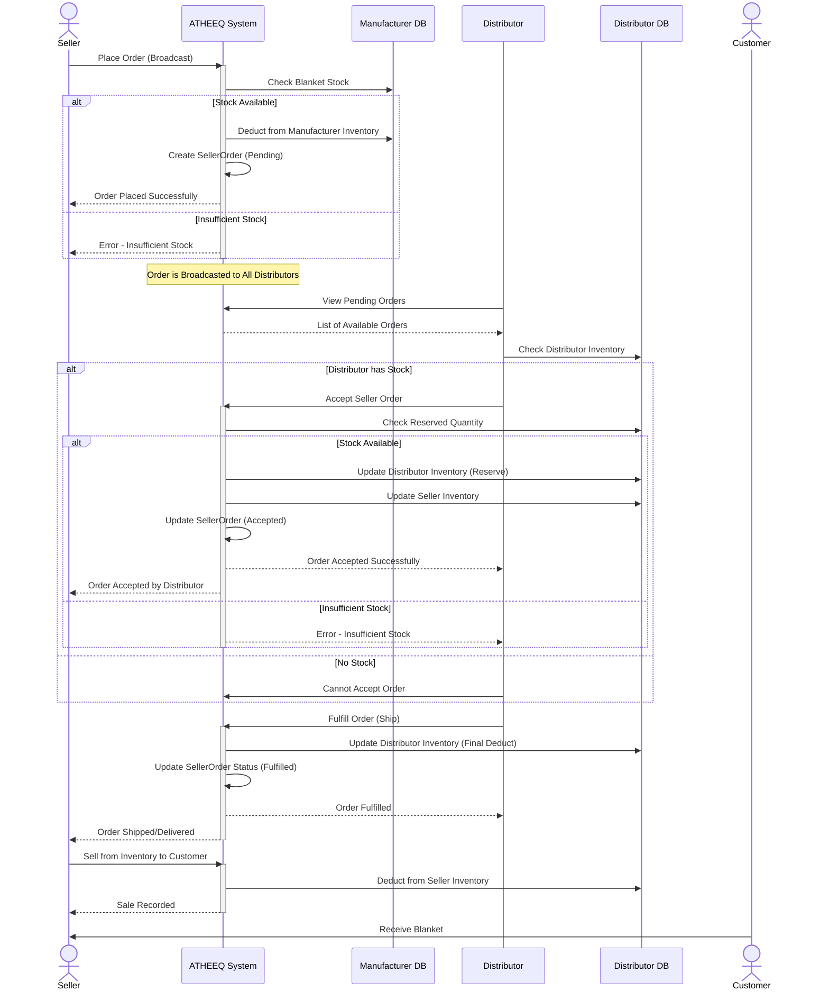
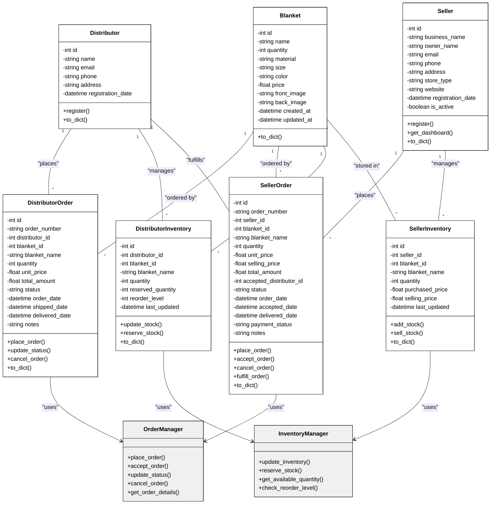

# ATHEEQ Project - System Diagrams

## 1. USE CASE DIAGRAM
Shows all actors and their interactions with the system.

```mermaid
graph TB
    subgraph Actors
        MFG["🏭 Manufacturer"]
        DIST["📦 Distributor"]
        SELLER["🛒 Seller"]
        CUST["👥 Customer"]
    end
    
    subgraph System["ATHEEQ - Blanket Supply Chain System"]
        UC1["Register Account"]
        UC2["Create/Manage Blankets"]
        UC3["Place Order to Distributor"]
        UC4["Place Broadcast Order"]
        UC5["Accept Seller Order"]
        UC6["Manage Inventory"]
        UC7["View Orders"]
        UC8["Update Order Status"]
        UC9["Cancel Order"]
        UC10["View Dashboard"]
        UC11["Sell from Inventory"]
    end
    
    MFG -->|Uses| UC1
    MFG -->|Uses| UC2
    MFG -->|Uses| UC6
    MFG -->|Uses| UC10
    
    DIST -->|Uses| UC1
    DIST -->|Uses| UC3
    DIST -->|Uses| UC5
    DIST -->|Uses| UC6
    DIST -->|Uses| UC7
    DIST -->|Uses| UC8
    DIST -->|Uses| UC10
    
    SELLER -->|Uses| UC1
    SELLER -->|Uses| UC4
    SELLER -->|Uses| UC6
    SELLER -->|Uses| UC7
    SELLER -->|Uses| UC9
    SELLER -->|Uses| UC10
    SELLER -->|Uses| UC11
    
    CUST -->|Uses| UC11
    
    style Actors fill:#f9f9f9,stroke:#000,color:#000
    style System fill:#ffffff,stroke:#000,color:#000
    style UC1 fill:#ffffff,stroke:#000,color:#000
    style UC2 fill:#ffffff,stroke:#000,color:#000
    style UC3 fill:#ffffff,stroke:#000,color:#000
    style UC4 fill:#ffffff,stroke:#000,color:#000
    style UC5 fill:#ffffff,stroke:#000,color:#000
    style UC6 fill:#ffffff,stroke:#000,color:#000
    style UC7 fill:#ffffff,stroke:#000,color:#000
    style UC8 fill:#ffffff,stroke:#000,color:#000
    style UC9 fill:#ffffff,stroke:#000,color:#000
    style UC10 fill:#ffffff,stroke:#000,color:#000
    style UC11 fill:#ffffff,stroke:#000,color:#000
```

---

## 2. ENTITY RELATIONSHIP (ER) DIAGRAM
Shows database schema and relationships.

---

## 3. SEQUENCE DIAGRAM
Shows the order broadcast and fulfillment workflow.

---

## 4. CLASS DIAGRAM
Shows the class structure and relationships.

---

## System Overview

### Three-Tier Architecture:
1. **Manufacturer (Tier 1)**: Produces blankets
2. **Distributors (Tier 2)**: Order from manufacturer, fulfill seller orders
3. **Sellers (Tier 3)**: Order from any distributor via broadcast, sell to customers

### Key Workflows:

#### 📊 Distributor Order Flow:
- Distributor places order to manufacturer
- Manufacturer deducts stock
- Distributor receives order (inventory updated)
- Distributor reserves stock for seller orders

#### 📤 Seller Order Broadcast Flow:
- Seller places order (broadcasted to all distributors)
- Order status: Pending
- Any distributor can accept if they have stock
- When accepted:
  - Distributor inventory updated (reserved → actual deduction)
  - Seller inventory updated automatically
  - Order status: Accepted
- Distributor fulfills and delivers
- Order status: Fulfilled

#### 💼 Seller Inventory & Sales:
- Inventory only updates when distributor accepts order
- Seller can sell from inventory to customers
- Tracks purchased price and selling price

---

## Status Codes

| Status | Entity | Meaning |
|--------|--------|---------|
| Pending | SellerOrder | Broadcasted, waiting for distributor |
| Accepted | SellerOrder | Distributor accepted, stock allocated |
| Fulfilled/Delivered | SellerOrder | Order completed |
| Cancelled | Any Order | Order cancelled, stock restored |

---

## Key Features

✅ **Broadcast Order System** - One seller order can be fulfilled by any distributor  
✅ **Inventory Tracking** - Separate inventory for each tier  
✅ **Reserved Quantities** - Distributors can reserve stock  
✅ **Dynamic Pricing** - Sellers set their selling prices  
✅ **Multi-tier Supply Chain** - Manufacturer → Distributor → Seller → Customer  
✅ **Order Status Management** - Track orders through complete lifecycle
